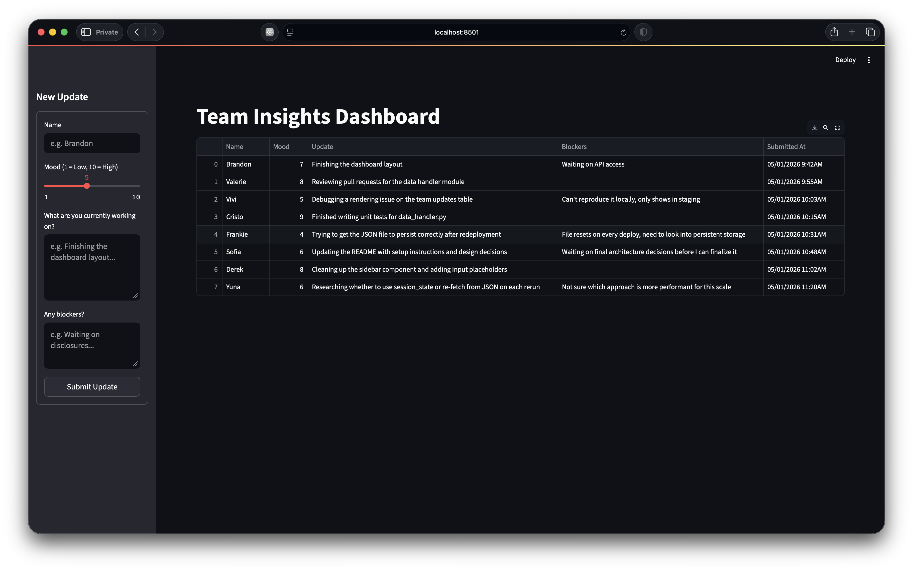

# Team Insights Dashboard



## Overview
A simple web application built with Streamlit that enables team members to submit daily check-ins and track team progress in real-time. 

## What It Does
- **Team Check-ins** - Each team member fills out a quick sidebar form once a day
- **Mood Tracking** - A 1–10 slider captures how everyone is feeling
- **Progress Visibility** - All updates are displayed together in one table so the whole team stays in sync
- **Blocker Identification** - Team members can flag anything slowing them down
- **Persistent Storage** - Updates are saved to `updates.json` so nothing is lost on refresh

## How It Works
1. **Submit** - Fill out the sidebar form and click Submit
2. **Validate** - The app checks that required fields are filled in correctly before saving
3. **Save** - The update is written to `data/updates.json` with an automatic timestamp
4. **Display** - The dashboard table refreshes immediately to show the new entry

## Features

### Sidebar Form
- **Name** - Who is submitting the update (required, letters and spaces only, 2–50 characters)
- **Mood** - A 1–10 slider, where 1 is low and 10 is high (required)
- **Work Update** - A short description of what you are working on (required, 10–500 characters)
- **Blockers** - Anything getting in your way (optional, leave blank if none)
- **Timestamp** - Added automatically when the form is submitted, no input needed

### Dashboard Table
- **All Updates in One Place** - Every submission from the team appears in a single table
- **Readable Timestamps** - Stored as ISO 8601 internally, displayed as `MM/DD/YYYY H:MMAM/PM`
- **Live Refresh** - The table updates immediately after each submission
- **Empty State** - If no updates exist yet, a prompt is shown instead of a blank table

## Edge Cases Handled
- **Invalid Form Data** - Required fields are validated before submission; clear error messages guide users
- **Missing Data File** - App creates `data/updates.json` automatically if it doesn't exist
- **Browser Refresh** - All data persists in JSON file, so refreshing the page won't lose updates
- **Duplicate Submissions** - Users can submit multiple updates; each gets its own timestamp


## Data Structure
Each team update contains:
```json
{
  "name": "Team Member Name",
  "mood": 7,
  "update": "Description of current work",
  "blockers": "Any obstacles (optional)",
  "timestamp": "2026-05-01T10:15:22.567390",
  "timestamp_display": "05/01/2026 10:15AM"
}
```

## Data Processing
The application automatically formats data for optimal display:
- **Timestamp Conversion**: ISO timestamps are converted to user-friendly "MM/DD/YYYY H:MMAM/PM" format
- **Column Formatting**: All table headers are converted to title case for consistent presentation
- **Data Cleaning**: Raw timestamp field is removed from display while preserving formatted version
- **Success Feedback**: Users receive immediate confirmation when updates are successfully submitted

## 🛠️ Tech Stack

| Layer      | Technology        |
|------------|-------------------|
| Frontend + Backend   | Streamlit   |
| Data Handling   | Pandas + JSON    |

---

## 🚀 Getting Started

### Prerequisites
- Python 3.10+
- Streamlit
- Pandas

### Installation

#### 1. Clone the repository
```bash
git clone git@github.com:brndnjrz/SoftwareDeveloper-RDO.git
```

#### 2. Move into the repository
```bash
cd SoftwareDeveloper-RDO
```

#### 3. Install required packages
```bash
pip install streamlit pandas
```

#### 4. Run the application
```bash
streamlit run app.py   
```

#### 3. Access the dashboard
- Open your browser to `http://localhost:8501`
- Use the sidebar form to submit team updates
- View all updates in the main dashboard

## 📋 Usage
1. **Submit an Update**: Fill out the form in the sidebar with your name, mood, and current work
2. **Add Blockers**: Optionally describe any obstacles you're facing  
3. **Receive Confirmation**: Get immediate success feedback when your update is submitted
4. **View Team Status**: Check the main dashboard to see everyone's formatted updates
5. **Track Progress**: Use readable timestamps to see the chronological flow of work

## 🗂️ Project Structure

```bash
SoftwareDeveloper-RDO/
├── .gitignore
├── app.py              
├── components/
│   ├── __init__.py
│   └── team_update_form.py
├── data/
│   └── updates.json 
├── screenshots/ 
│   └── dashboard_view.png      
├── utils/
│   └── data_handler.py
└── README.md
```

### Component Details
- **`app.py`**: Main application that configures Streamlit, processes form submissions, formats data for display, and renders the dashboard table
- **`team_update_form.py`**: Contains form rendering logic, comprehensive input validation, and timestamp formatting functions
- **`data_handler.py`**: Handles loading and saving team updates to/from JSON storage with automatic directory creation
- **`updates.json`**: Stores all team check-ins with ISO timestamps in JSON format
- **`screenshots/`**: Contains application interface screenshots for documentation purposes


## 🤖 AI Usage Log

---

### Log

| # | Prompt Summary | What Was Applied |
|---|---|---|
| 1 | Generate a README template for the pre-work challenge | Used as the base structure for `README.md`, filled in all sections manually |
| 2 | Generate a clean modular Streamlit form component from existing `app.py` | Used as the foundation for `components/team_update_form.py`, reviewed and wired into `app.py` manually |
| 3 | Generate 7 sample submissions matching the existing JSON structure | Used directly as data in `data/updates.json` for local testing and dashboard display |
| 4 | Write a validation function for `team_update_form.py` covering edge cases | Reviewed the `validate_form()` function and integrated it into the form component |
| 5 | Improve and update `README.md` to document how the app works | Used as the starting point for the README, then manually edited for accuracy and tone |
| 6 | Format the ISO timestamp to `MM/DD/YYYY H:MMAM/PM` for display | Added `format_timestamp()` helper to `team_update_form.py` and updated the return dict |
| 7 | Add edge case handling to `data_handler.py` | Reviewed and applied guards for empty file, invalid JSON, wrong type, and write errors |
| 8 | Add edge case handling to the DataFrame section in `app.py` | Applied column existence checks and empty state message directly into `app.py` |
| 9 | Update `README.md` to document edge cases without overengineering | Added **Edge Cases Handled** section to the README |

---

### How AI Was Used

 All AI assistance was provided through Claude (Apple Internal) via Interlinked. Prompts were used to scaffold, improve, and validate code. All output was
 reviewed, tested, and manually applied. Prompts were written with specific context (existing code, file structure, and constraints) to get targeted output rather than generic boilerplate.

What I wrote myself:
- App architecture and file structure decisions
- Wiring components together in `app.py`
- Choosing the tech stack and overall approach
- All final edits to the README

What AI assisted with:
- Initial component scaffolding from existing code
- Validation logic and edge case identification
- Timestamp formatting helper
- README structure and wording
- Data for `updates.json`
